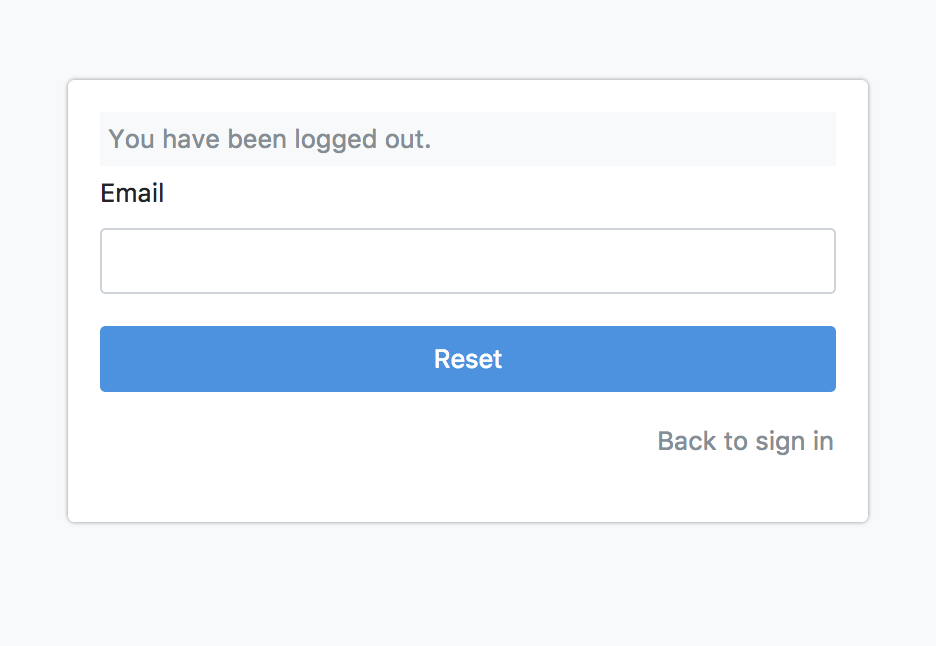
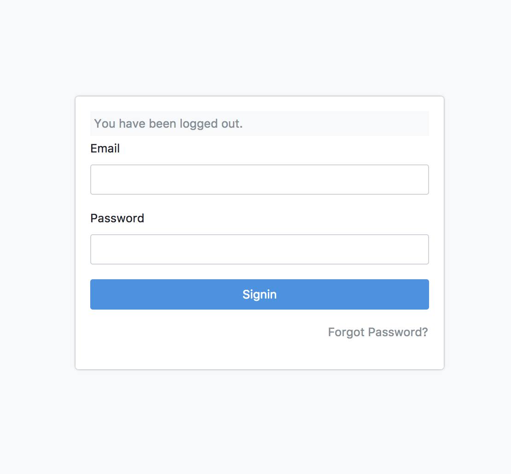
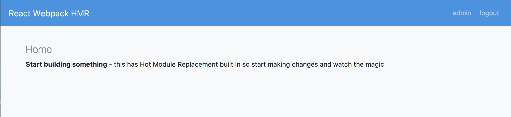
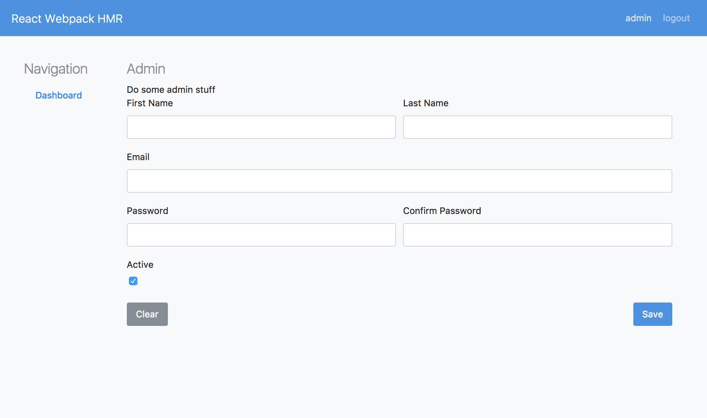

### React-Redux-Webpack-KeystoneJS Boilerplate

---

### Usage

    yarn install          # or npm install
    npm run dev           # runs server with webpack HMR
    npm run serve:prod    # builds bundles and starts server

> make sure your mongo process is running

> make sure you have setup the .env file (template provided .env-template)

### Requirements

- NodeJS

    > v8.9.1

- MongoDB

### Features

- **KeystoneJS - 4.0.0-beta.5**

- **Webpack - 3.5.5**

    webpack is setup to run hot module reloading and to build for production

- **SASS**

    **gulp-sass** compiles `public/styles/scss` directory to one `public/styles/site.css` file

- **Bootstrap 4**

    Bootstrap 4 (beta) is included and is ready to go

- **Font Awesome - 4.7.0**

    Font Awesome included in scss

- **React - 16.1.0**

    React with Redux (3.7.2) and HMR middleware (2.20.0)

- **reset password** - makes an api call that will send an email with a password link

    

- **signin**

    

- **Hot Module Reload ready**

    

- **React Routing** - react-router-dom@4.2.2

    
